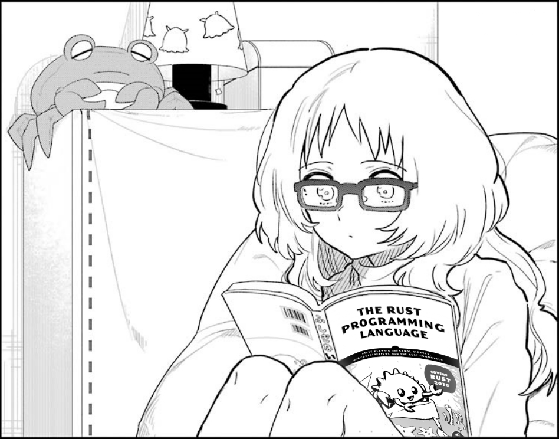

# learning_rust 🦀

This repo is more or less my journal on my daily effort to learn rust
i try to update this maarkdown file with every progress i make in learning rust, daily.

## day 0
started reading the official rust book for newbies; "The Rust Programming Language"

With its direction, i installed rust and its build system, cargo, with the rustup cli tool, wrote my first rust program (of course its a "Hello, world!" program) and compiled with the "rustc" command

got introduced to cargo(very neat tool and it is very similar to npm and node.js imo) and learnt how to initialize my rust projects with cargo 

## day 1

red chapter 2 of the book and wrote my first project (a guessing game) in rust. it was fun and i kinda enjoyed it

used the rust's std::io lib(for i/o stuff) and learnt how to collect user input from StdIn with read_line() method. 

i found that types in Rust are kinda similar to how it is in typescript, it has its own methods and can share with other types, kinda like classes

the Result type has two variants, Ok(successful operations) and Err(unsuccessful),(Result type is kinda like Promises in js), learnt a little about error handling, albeit not the best, with .expect() method, learnt how to use the "println!()" macro and how to print values and variables on the StdOut with placeholders

uh i also learnt a little about associated functions and types
used a mutable variable for the first time, learnt a bit about "String" type and how to create new instances of the type

learnt how to install dependencies(or crates like how rustceans call it) with cargo, simply just paste the name of the dependency with its version number in the 
cargo.toml file and run the `cargo build` command, it will download the dependency and compile it for use in your project

learnt how to use external crates and learnt a little about traits like `rand::Rng`
used the `std::cmp::Ordering` type with the .cmp() method in the project to compare the user's guess with user's guess with the generated random number with the `match` expression(which has patterns arms or whatever), a much better version of switch case statements(can be used in error handling)

there is also a `loop` statement that creates an endless loop or something but can be broken with uh idk the `break` statement, bascially how loops work in other languages

learnt a lot in this chapter, having fun reading this book

well here is the [link](https://github.com/eghosaclinton/rust_guessing_game) to the code on github

started rustlings as well
did exercises 1 - 11(i guess experience as a programmer and chapter 1 and 2 of the book could only carry me so far)

## day 2

began learning how common programming concepts are handled in rust.

